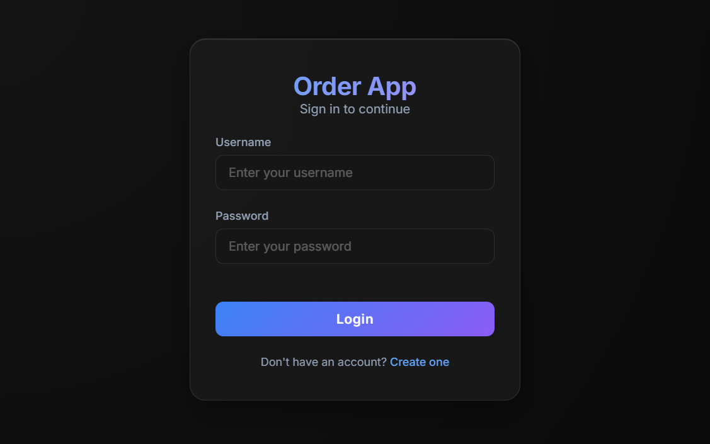
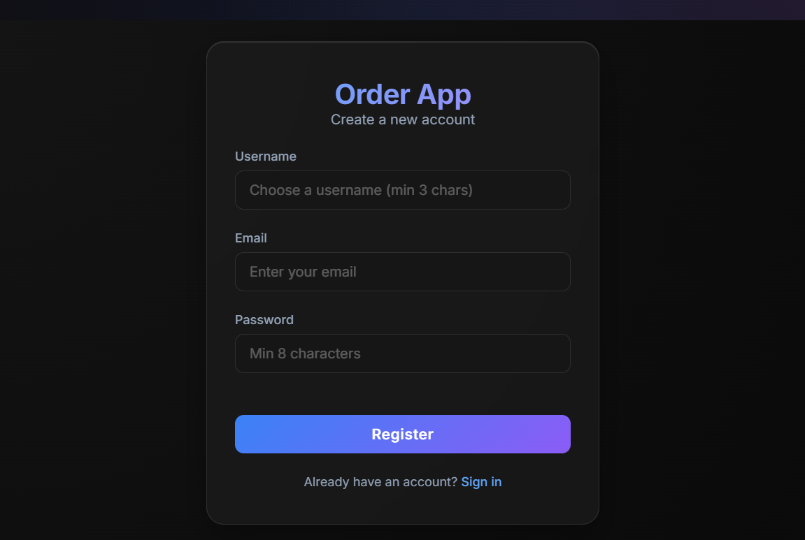
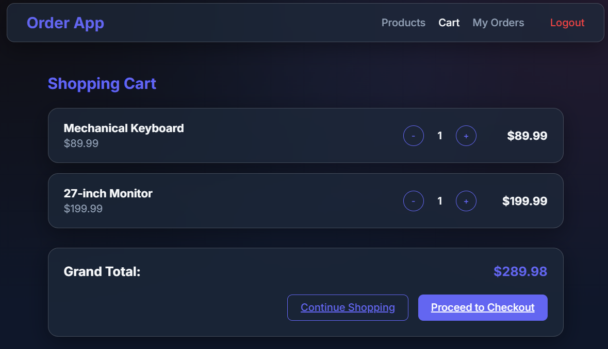
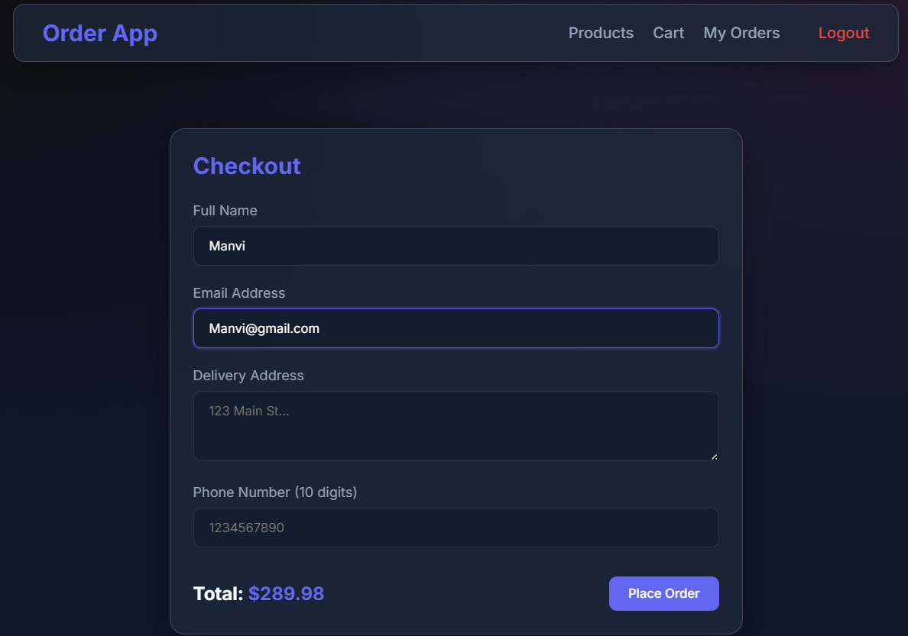
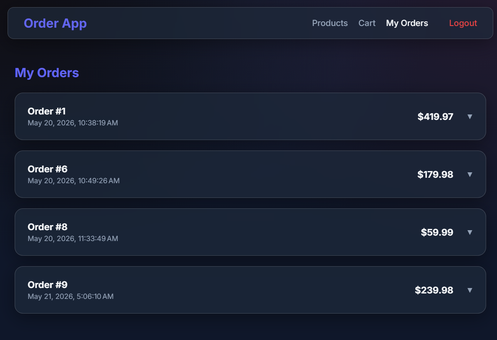

<div align="center">

# Order App

### A full-stack e-commerce system — Angular 19 frontend · FastAPI backend · SQLite storage


</div>

---

## Overview

Order App is a production-structured, full-stack web application that covers the complete commerce lifecycle — register, browse a product catalog, manage a reactive cart, and check out. Every layer from Angular form validation down to SQLite row insertion is wired together, making it a clean vertical reference for how a real Angular + FastAPI system fits end-to-end.

**What makes it interesting:**
- **Zero-framework UI** — dark glassmorphic aesthetic using only vanilla CSS (`backdrop-filter`, radial gradients, CSS custom properties). No component library.
- **Reactive-first cart** — RxJS `BehaviorSubject` propagates cart state across all components in real time without a reload.
- **Dual validation** — Angular `FormGroup` guards the UI; Pydantic schemas guard the API. Neither trusts the other.
- **Historical price integrity** — `OrderItem` snapshots `price_at_order` at checkout so order history never drifts if catalog prices change later.
- **Auto-seeded database** — FastAPI's `lifespan` hook creates tables and seeds demo products on first run. Zero manual setup.

---

## Screenshots

<table>
  <tr>
    <td align="center"><b>Sign In</b></td>
    <td align="center"><b>Register</b></td>
  </tr>
  <tr>
    <td></td>
    <td></td>
  </tr>
  <tr>
    <td align="center"><b>Shopping Cart</b></td>
    <td align="center"><b>Checkout</b></td>
  </tr>
  <tr>
    <td></td>
    <td></td>
  </tr>
  <tr>
    <td align="center" colspan="2"><b>Order History</b></td>
  </tr>
  <tr>
    <td colspan="2" align="center"></td>
  </tr>
</table>

---

## Tech Stack

| Layer | Technology |
|-------|-----------|
| Frontend framework | Angular 19+ (Standalone Components, functional interceptors) |
| State management | RxJS `BehaviorSubject` |
| Styling | Vanilla CSS — glassmorphic dark theme, no UI library |
| HTTP | Angular `HttpClient` + functional interceptors |
| Backend framework | FastAPI (Python) with auto-generated Swagger docs |
| ORM | SQLAlchemy declarative mapping |
| Database | SQLite (single-file, zero config) |
| Validation | Pydantic schemas (backend) · Angular `FormGroup` (frontend) |
| Security | SHA-256 password hashing · Bearer token auth |

---

## Project Structure

```
order-app-workspace/
│
├── backend/
│   ├── main.py          # App factory, CORS, lifespan hook, DB seeding
│   ├── database.py      # SQLAlchemy engine, SessionLocal, get_db dependency
│   ├── models.py        # ORM tables: User, Product, Order, OrderItem
│   ├── schemas.py       # Pydantic request/response models + validators
│   ├── order_app.db     # SQLite file (auto-created on first run)
│   └── routers/
│       ├── auth.py      # Register · Login · /me
│       ├── products.py  # Product catalog + seed logic
│       └── orders.py    # Create · list · patch status
│
└── order-app/
    └── src/app/
        ├── app.ts                        # Root shell component
        ├── app.config.ts                 # Providers: HttpClient, router, interceptors
        ├── app.routes.ts                 # /login · /products · /cart · /place-order · /orders
        ├── login/                        # Login & register views with reactive forms
        ├── products/                     # Product grid with stock-aware add-to-cart
        ├── cart/                         # Quantity controls, running total, checkout link
        ├── orders/
        │   ├── place-order/              # Checkout form (pre-filled from localStorage)
        │   └── order-list/               # Collapsible order history cards
        ├── services/
        │   ├── cart.ts                   # BehaviorSubject cart store
        │   └── order.ts                  # HTTP wrappers for order endpoints
        ├── shared/navbar/                # Global navigation bar
        └── interceptors/
            ├── auth-interceptor.ts       # Injects Authorization: Bearer <token>
            └── http-error-interceptor.ts # Global error → toast notification
```

---

## Architecture

```
Browser (:4200)
─────────────────────────────────────────────────────────
  Angular Views  ←→  CartService (BehaviorSubject)
        │
  Auth Interceptor  →  Error Interceptor  →  HTTP Request
        │
─────────────────────────────────────────────────────────
FastAPI (:8000)
─────────────────────────────────────────────────────────
  /auth   /api/products   /api/orders
        │
  Pydantic Validation  +  get_current_user()
        │
  SQLAlchemy ORM
        │
─────────────────────────────────────────────────────────
  order_app.db  (SQLite)
```

---

## Authentication Flow

```
Register  →  SHA-256(password) stored in DB

Login     →  credentials verified
          →  returns { access_token: "mock_token_<username>", username, email }
          →  cached in localStorage

Every request  →  authInterceptor reads token
               →  appends: Authorization: Bearer mock_token_<username>

FastAPI  →  get_current_user() parses token
         →  queries DB, injects User ORM object into route handler
```

---

## API Reference

> Full interactive docs at **`http://localhost:8000/docs`**

### Auth — `/auth`

| Method | Endpoint | Auth | Description |
|--------|----------|:----:|-------------|
| `POST` | `/auth/register` | ✗ | Create account — validates uniqueness, stores hashed password |
| `POST` | `/auth/login` | ✗ | Returns bearer token + user info |
| `GET` | `/auth/me` | ✓ | Current user `id`, `username`, `email` |

### Products — `/api/products`

| Method | Endpoint | Auth | Description |
|--------|----------|:----:|-------------|
| `GET` | `/api/products` | ✗ | Full catalog with name, price, stock quantity |

### Orders — `/api/orders`

| Method | Endpoint | Auth | Description |
|--------|----------|:----:|-------------|
| `POST` | `/api/orders` | ✓ | Validate stock → decrement inventory → persist order |
| `GET` | `/api/orders` | ✓ | All orders for the authenticated user |
| `PATCH` | `/api/orders/{id}` | ✓ | Update order status |

---

## Database Schema

```
USERS                    PRODUCTS
──────────────────       ──────────────────
id          PK           id          PK
username    UNIQUE        name
email       UNIQUE        price
hashed_pwd               stock_qty
    │
    │ 1:N
    ▼
ORDERS                   ORDER_ITEMS
──────────────────       ──────────────────
id          PK           id              PK
user_id     FK ───┐      order_id        FK ──→ ORDERS
customer_name     │      product_id      FK ──→ PRODUCTS
customer_email    │      qty
delivery_address  └───── price_at_order       ← value snapshot
phone
status
created_at
```

`price_at_order` is a **snapshot** — historical totals never change when catalog prices update.  
`Order → OrderItem` uses `cascade="all, delete-orphan"` — deleting an order cleans up its line items automatically.

---

## Validation

Both layers validate independently. Frontend for UX speed; backend as the security boundary.

| Field | Angular | Pydantic |
|-------|---------|---------|
| Username | required · minLength(3) · `^[a-zA-Z0-9_]+$` | min=3 · max=30 · same pattern |
| Email | required · `Validators.email` | `EmailStr` |
| Password | required · minLength(8) on register | min=8 · max=64 |
| Phone | required · `^[0-9]{10}$` | `^\d{10}$` |
| Address | required · minLength(5) | min=5 |
| Item Qty | UI counter ≥ 1 | `Field(gt=0)` |

---

## Local Setup

### Backend

```bash
cd backend
python -m venv venv

# Windows
.\venv\Scripts\Activate.ps1
# macOS / Linux
source venv/bin/activate

pip install fastapi uvicorn sqlalchemy pydantic email-validator
uvicorn main:app --reload
```

→ API: `http://127.0.0.1:8000`  
→ Swagger UI: `http://127.0.0.1:8000/docs`

> First run creates and seeds the database automatically.

### Frontend

```bash
cd order-app
npm install
npx ng serve
```

→ App: `http://localhost:4200`

---

## Known Limitations

This project is architecture-correct but intentionally simplified in a few areas:

| Area | Current | Production equivalent |
|------|---------|----------------------|
| Token format | `mock_token_<username>` | Signed JWT |
| Password hashing | SHA-256 | bcrypt / argon2 |
| Database | SQLite | PostgreSQL / MySQL |
| Token storage | `localStorage` | `httpOnly` cookie |

---

<div align="center">
Angular · FastAPI · SQLAlchemy · RxJS · SQLite · TypeScript · Python
</div>
